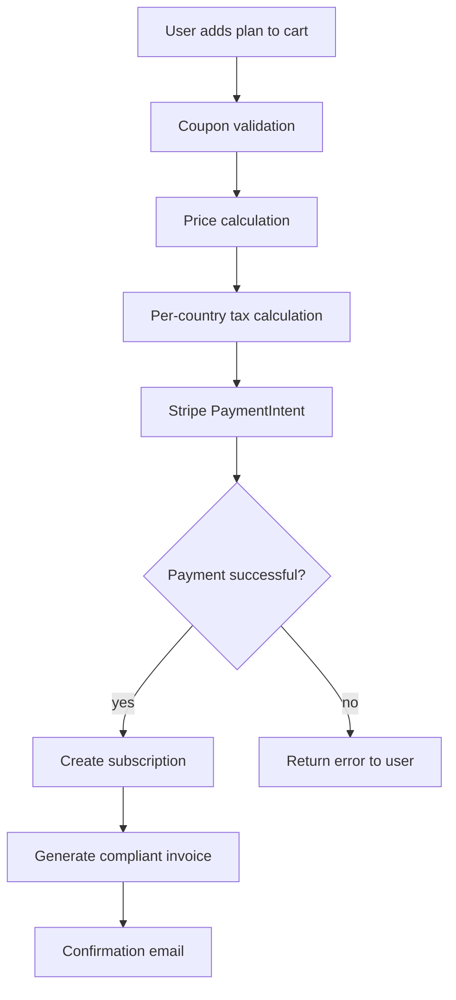
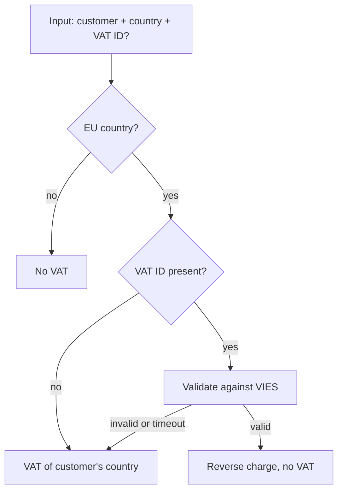

# Domain Memory — Data schema

This document fixes the structure of the system's data. The markdown files on disk are the **source of truth**. SQLite is a derived index that can be rebuilt from the files at any time.

---

## On-disk layout

Everything lives under `.domain-memory/` at the root of the project where it is installed:

```
.domain-memory/
├── instructions.md                ← instructions for the agent (copy of the template)
├── config.json                    ← mode, version, install config
├── knowledge/                     ← source of truth — versioned
│   ├── <feature-slug>/
│   │   ├── feature.md
│   │   └── aspects/
│   │       ├── <aspect-slug>.md
│   │       └── ...
│   └── ...
├── staging/                       ← runtime, not versioned
│   └── <branch-slug>.jsonl
├── index.sqlite                   ← derived index, not versioned
└── errors.log                     ← log of silenced failures
```

**Git versioning**: the `.gitignore` written by the installer includes:
```
.domain-memory/staging/
.domain-memory/index.sqlite
.domain-memory/index.sqlite-*
.domain-memory/errors.log
```

Everything else (`knowledge/`, `instructions.md`, `config.json`) **is committed**. Changes to `knowledge/` show up in diffs alongside the code changes, so reviewers can read them in the same place.

**Slugs**: lowercase, kebab-case, `[a-z0-9-]` only. Generated from the human name by the agent, fixed at entry creation.

---

## `feature.md` format

```markdown
---
id: feat_checkout
slug: checkout
name: Checkout
type: feature
status: active
confidence: 80
created_at: 2026-04-11T10:30:00Z
updated_at: 2026-04-11T10:30:00Z
last_verified: 2026-04-11T10:30:00Z
file_paths:
  - src/Checkout/
  - src/Checkout/Application/CreateCheckoutHandler.php
symbols:
  - Acme\Checkout\Application\CreateCheckoutHandler
  - Acme\Checkout\Domain\Checkout
content_hashes:
  src/Checkout/Application/CreateCheckoutHandler.php: sha256:abc123...
relations:
  depends_on:
    - feat_auth
  triggers:
    - feat_subscription
  related_to:
    - feat_invoicing
tags:
  - payments
  - billing
---

## What it does

3–10 lines of prose explaining the high-level business logic. The "why",
not the "what". A new developer should be able to read this and
understand the feature in 30 seconds.

## How it flows



## Where it lives

- `src/Checkout/` — full module
- `src/Checkout/Application/CreateCheckoutHandler.php` — CQRS entry point
- See aspects for specific details on pricing, taxes, Stripe, etc.
```

**Rules**:
- `id` is immutable once created (`feat_<slug>` or `asp_<slug>`).
- `slug` can change (rename) but `id` stays.
- `file_paths` accepts directories (ending with `/`) or specific files.
- `symbols` are fully qualified names (namespace + class or function).
- `content_hashes` is only for specific files, not for directories.
- The Mermaid block is **mandatory** if the feature describes a flow.
- The `What it does`, `How it flows`, `Where it lives` sections are mandatory by name.

---

## `aspect.md` format

```markdown
---
id: asp_checkout_taxes
slug: taxes
name: Tax calculation
type: aspect
feature_id: feat_checkout
status: active
confidence: 85
created_at: 2026-04-11T10:45:00Z
updated_at: 2026-04-11T10:45:00Z
last_verified: 2026-04-11T10:45:00Z
file_paths:
  - src/Checkout/Domain/TaxCalculator.php
  - src/Checkout/Domain/VatRate.php
symbols:
  - Acme\Checkout\Domain\TaxCalculator
  - Acme\Checkout\Domain\VatRate
content_hashes:
  src/Checkout/Domain/TaxCalculator.php: sha256:def456...
  src/Checkout/Domain/VatRate.php: sha256:ghi789...
tags:
  - taxes
  - vat
  - compliance
---

## What it does

For EU B2B customers with a valid VAT ID we apply reverse charge — we do
not add VAT, the customer self-assesses in their country. For B2C we
always add the VAT of the customer's country (detected from IP +
billing). For customers outside the EU, no VAT.

The VAT ID validation hits the European Commission's VIES service. If
VIES does not respond, we assume B2C and apply VAT — we prefer
overcharging to having tax problems.

## How it flows



## Where it lives

- `src/Checkout/Domain/TaxCalculator.php:42` — main logic
- `src/Checkout/Domain/VatRate.php` — per-country rate table
```

**Differences vs feature**:
- `type: aspect` and `feature_id` pointing at the parent.
- No `relations` (aspects don't relate to each other directly — their parent features do).
- Mermaid is optional (some aspects are pure text).

---

## Staging format — `.domain-memory/staging/<branch-slug>.jsonl`

One finding per line. Append-only during the session. Indexed by git branch.

```jsonl
{"id":"find_01HX...","ts":"2026-04-11T11:02:33Z","topic":{"feature_hint":"checkout","aspect_hint":"taxes"},"finding":"The VAT ID is validated against VIES, but if VIES is down we assume B2C and charge VAT — we prefer overcharging.","file_paths":["src/Checkout/Domain/TaxCalculator.php"],"symbols":["Acme\\Checkout\\Domain\\TaxCalculator"],"source":"user_explained","session_id":"sess_xyz","client":"claude-code"}
{"id":"find_01HX...","ts":"2026-04-11T11:15:08Z","topic":{"feature_hint":"checkout","aspect_hint":"stripe"},"finding":"The invoice.payment_succeeded webhook is ignored for trial subscriptions because it arrives but there is no real payment.","file_paths":["src/Checkout/Infrastructure/StripeWebhookController.php"],"symbols":[],"source":"user_explained","session_id":"sess_xyz","client":"claude-code"}
```

**Fields**:
- `id` — ULID, generated locally.
- `ts` — ISO 8601 UTC.
- `topic.feature_hint` — tentative feature slug (the agent proposes, consolidation confirms).
- `topic.aspect_hint` — tentative aspect slug (optional).
- `finding` — short prose, 1–3 sentences.
- `file_paths`, `symbols` — same as in entries.
- `source` — one of: `user_explained`, `inferred_from_code`, `inferred_from_tests`, `user_correction`.
- `session_id` — id of the client session that wrote it (debug / trace).
- `client` — which MCP client generated it (`claude-code`, `cursor`, etc.).

**Lifecycle**: created on the first finding of a branch. Read during `/save-knowledge` or when opening a PR. Cleared (renamed to `<branch-slug>.jsonl.consolidated-<ts>` for audit) after successful consolidation. If the branch is deleted without consolidation, it is orphaned and the periodic `check-drift` cleans it up after 30 days.

---

## SQLite index — `index.sqlite`

The index is derived and rebuildable. If it corrupts, it is regenerated by scanning `knowledge/`.

### `entries` table

```sql
CREATE TABLE entries (
    id              TEXT PRIMARY KEY,        -- feat_checkout, asp_checkout_taxes
    type            TEXT NOT NULL,           -- 'feature' | 'aspect'
    slug            TEXT NOT NULL,
    name            TEXT NOT NULL,
    feature_id      TEXT,                    -- NULL for features, points to feat_* for aspects
    status          TEXT NOT NULL,           -- 'active' | 'archived' | 'superseded'
    superseded_by   TEXT,                    -- id of another entry if applicable
    confidence      INTEGER NOT NULL,        -- 0-100
    created_at      TEXT NOT NULL,
    updated_at      TEXT NOT NULL,
    last_verified   TEXT NOT NULL,
    file_path       TEXT NOT NULL,           -- path of the .md on disk, relative
    summary         TEXT NOT NULL,           -- first paragraph of "What it does", for candidates
    FOREIGN KEY (feature_id) REFERENCES entries(id)
);

CREATE INDEX idx_entries_type ON entries(type);
CREATE INDEX idx_entries_feature ON entries(feature_id);
CREATE INDEX idx_entries_status ON entries(status);
CREATE INDEX idx_entries_confidence ON entries(confidence);
```

### `entry_paths` table

One row per `file_path` of an entry. Powers the path matcher.

```sql
CREATE TABLE entry_paths (
    entry_id    TEXT NOT NULL,
    path        TEXT NOT NULL,
    is_dir      INTEGER NOT NULL,            -- 0 | 1
    content_hash TEXT,                        -- NULL if is_dir
    PRIMARY KEY (entry_id, path),
    FOREIGN KEY (entry_id) REFERENCES entries(id) ON DELETE CASCADE
);

CREATE INDEX idx_entry_paths_path ON entry_paths(path);
```

### `entry_symbols` table

One row per symbol. Powers the symbol matcher (survives renames).

```sql
CREATE TABLE entry_symbols (
    entry_id    TEXT NOT NULL,
    symbol      TEXT NOT NULL,
    PRIMARY KEY (entry_id, symbol),
    FOREIGN KEY (entry_id) REFERENCES entries(id) ON DELETE CASCADE
);

CREATE INDEX idx_entry_symbols_symbol ON entry_symbols(symbol);
```

### `entry_relations` table

Features only (aspects don't have their own relations).

```sql
CREATE TABLE entry_relations (
    from_id     TEXT NOT NULL,
    to_id       TEXT NOT NULL,
    kind        TEXT NOT NULL,               -- 'depends_on' | 'triggers' | 'related_to'
    PRIMARY KEY (from_id, to_id, kind),
    FOREIGN KEY (from_id) REFERENCES entries(id) ON DELETE CASCADE,
    FOREIGN KEY (to_id)   REFERENCES entries(id) ON DELETE CASCADE
);
```

### `entry_tags` table

```sql
CREATE TABLE entry_tags (
    entry_id    TEXT NOT NULL,
    tag         TEXT NOT NULL,
    PRIMARY KEY (entry_id, tag),
    FOREIGN KEY (entry_id) REFERENCES entries(id) ON DELETE CASCADE
);

CREATE INDEX idx_entry_tags_tag ON entry_tags(tag);
```

### FTS5 — keyword search (BM25)

```sql
CREATE VIRTUAL TABLE entries_fts USING fts5(
    entry_id UNINDEXED,
    name,
    summary,
    body,
    tokenize = 'unicode61 remove_diacritics 2'
);
```

Repopulated from the `.md` file on every update. `body` contains the markdown body (no frontmatter, no mermaid blocks).

### Vectors — `sqlite-vec`

```sql
CREATE VIRTUAL TABLE entries_vec USING vec0(
    entry_id TEXT PRIMARY KEY,
    embedding FLOAT[384]        -- MiniLM-L6-v2 dimension
);
```

The embedding is computed over `name + "\n" + summary` and regenerated on every update.

### `pending_conflicts` table

```sql
CREATE TABLE pending_conflicts (
    id              TEXT PRIMARY KEY,
    entry_id        TEXT NOT NULL,
    proposed_at     TEXT NOT NULL,
    proposed_by     TEXT NOT NULL,           -- branch + client
    existing_body   TEXT NOT NULL,
    proposed_body   TEXT NOT NULL,
    status          TEXT NOT NULL,           -- 'open' | 'resolved' | 'discarded'
    FOREIGN KEY (entry_id) REFERENCES entries(id)
);
```

This table is almost always empty because conflicts are resolved live.

---

## MCP tool payloads

### `search_knowledge`

**Input**:
```json
{
  "query": "how do we compute VAT in checkout for EU B2B?",
  "context": {
    "file_paths": ["src/Checkout/Domain/TaxCalculator.php"],
    "symbols": ["Acme\\Checkout\\Domain\\TaxCalculator"],
    "current_branch": "feat/taxes-refactor"
  },
  "limit": 10
}
```

**Output**:
```json
{
  "candidates": [
    {
      "id": "asp_checkout_taxes",
      "type": "aspect",
      "name": "Tax calculation",
      "feature_id": "feat_checkout",
      "feature_name": "Checkout",
      "summary": "For EU B2B customers with a valid VAT ID we apply reverse charge...",
      "confidence": 85,
      "status": "active",
      "last_verified": "2026-04-11T10:45:00Z",
      "scores": {
        "embedding": 0.87,
        "bm25": 0.72,
        "path": 1.0,
        "combined": 0.91
      },
      "match_reasons": ["path_exact", "symbol_exact", "semantic"],
      "content_path": ".domain-memory/knowledge/checkout/aspects/taxes.md"
    }
  ],
  "elapsed_ms": 45
}
```

The agent uses `content_path` to read the full file when it needs more context than the `summary`.

### `save_knowledge`

**Input**:
```json
{
  "action": "create" | "update" | "archive" | "supersede",
  "entry": {
    "type": "feature" | "aspect",
    "slug": "taxes",
    "name": "Tax calculation",
    "feature_id": "feat_checkout",
    "body": {
      "what": "For EU B2B customers...",
      "flow_mermaid": "flowchart TD\n  A[...]",
      "where": "- src/Checkout/Domain/TaxCalculator.php:42"
    },
    "file_paths": ["src/Checkout/Domain/TaxCalculator.php"],
    "symbols": ["Acme\\Checkout\\Domain\\TaxCalculator"],
    "tags": ["taxes", "vat"]
  },
  "target_id": "asp_checkout_taxes",
  "supersedes": null,
  "expected_updated_at": "2026-04-11T10:45:00Z"
}
```

- `action` describes the operation.
- `target_id` is required for `update`, `archive`, `supersede`; absent for `create`.
- `expected_updated_at` is the optimistic lock — if the entry has been modified after that timestamp, `save_knowledge` fails with `conflict_stale`.
- `body.flow_mermaid` can be null if not applicable.

**Output (success)**:
```json
{
  "status": "ok",
  "entry_id": "asp_checkout_taxes",
  "file_written": ".domain-memory/knowledge/checkout/aspects/taxes.md",
  "confidence_after": 85
}
```

**Output (content conflict)**:
```json
{
  "status": "conflict_contradiction",
  "entry_id": "asp_checkout_taxes",
  "existing_body": {...},
  "proposed_body": {...},
  "message": "Existing entry contradicts proposed. Resolve with user before retrying."
}
```

The agent **must not retry automatically**. It must ask the user.

### `stage_finding`

**Input**:
```json
{
  "branch": "feat/taxes-refactor",
  "finding": {
    "topic": {"feature_hint": "checkout", "aspect_hint": "taxes"},
    "finding": "The VAT ID is validated against VIES...",
    "file_paths": ["src/Checkout/Domain/TaxCalculator.php"],
    "symbols": ["Acme\\Checkout\\Domain\\TaxCalculator"],
    "source": "user_explained",
    "session_id": "sess_xyz",
    "client": "claude-code"
  }
}
```

**Output**:
```json
{"status": "ok", "finding_id": "find_01HX..."}
```

### `read_staging`

**Input**:
```json
{"branch": "feat/taxes-refactor"}
```

**Output**:
```json
{
  "branch": "feat/taxes-refactor",
  "findings": [ ... full list ... ],
  "count": 7,
  "first_ts": "2026-04-11T11:02:33Z",
  "last_ts": "2026-04-11T14:20:10Z"
}
```

If there is no staging for that branch: `{"branch": "...", "findings": [], "count": 0}`.

### `check_drift`

**Input**:
```json
{
  "file_paths": [
    "src/Checkout/Domain/TaxCalculator.php",
    "src/Checkout/Domain/VatRate.php"
  ]
}
```

**Output**:
```json
{
  "affected_entries": [
    {
      "id": "asp_checkout_taxes",
      "name": "Tax calculation",
      "feature_name": "Checkout",
      "matched_paths": [
        "src/Checkout/Domain/TaxCalculator.php",
        "src/Checkout/Domain/VatRate.php"
      ],
      "last_verified": "2026-04-11T10:45:00Z",
      "confidence": 85,
      "content_path": ".domain-memory/knowledge/checkout/aspects/taxes.md"
    }
  ]
}
```

The agent uses this when opening a PR to ask the user about each affected entry.

---

## Reconstruction principle

At any time, `domain-memory reindex` can:

1. Delete `index.sqlite`.
2. Scan `knowledge/**/*.md`.
3. Parse the frontmatter and body of each file.
4. Repopulate every SQLite table from scratch.
5. Recompute embeddings.

This guarantees that **the markdown files are the only source of truth**. The index is a derived, disposable cache. If there is a discrepancy, the file wins.
